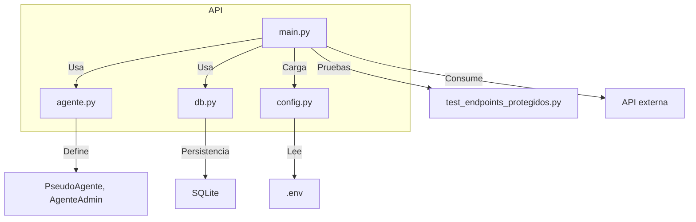
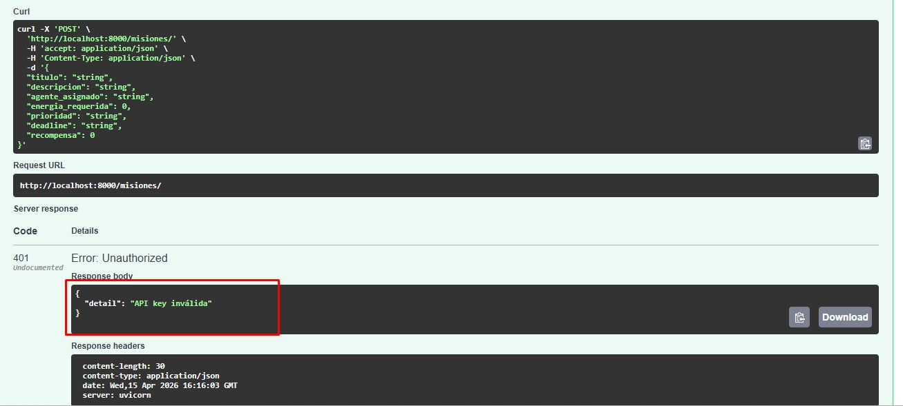
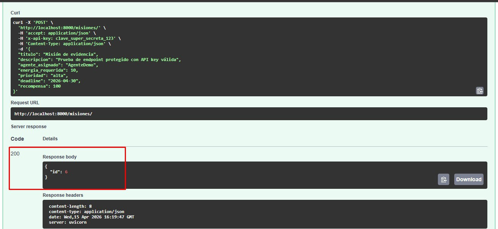
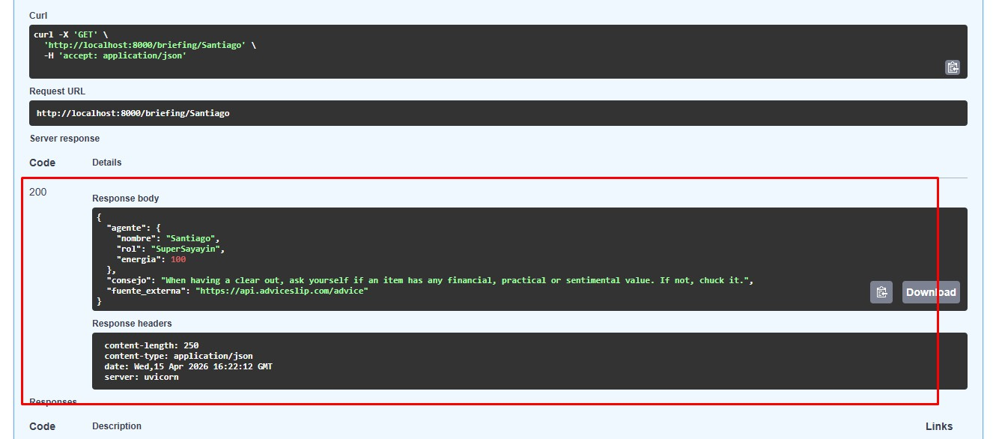

## Referencias consultadas

- [FastAPI — User Guide](https://fastapi.tiangolo.com/tutorial/)
- [FastAPI Security — API Key](https://fastapi.tiangolo.com/advanced/security/)
- [Python-dotenv — Documentación](https://saurabh-kumar.com/python-dotenv/)
- [Python logging — Logging HOWTO](https://docs.python.org/3/howto/logging.html)
- [SQLite — Python 3 documentation](https://docs.python.org/3/library/sqlite3.html)
- [Pydantic v2 — Usage](https://docs.pydantic.dev/latest/usage/)
- [requests — Quickstart](https://requests.readthedocs.io/en/latest/user/quickstart/)
- [Advice Slip JSON API](https://api.adviceslip.com/)
## Decisiones de Ingeniería

### 1. Esquema de la tabla `misiones`
Además de los campos mínimos, agregué:
- `prioridad`: para permitir gestión de misiones urgentes o importantes.
- `deadline`: para establecer fechas límite y simular escenarios reales de gestión de tareas.
- `recompensa`: para incentivar el cumplimiento y modelar sistemas de motivación.
Estas columnas permiten enriquecer la lógica de negocio y facilitan futuras extensiones (por ejemplo, reportes o filtros avanzados).

### 2. API pública elegida
Se eligió la API https://api.adviceslip.com/advice porque entrega consejos aleatorios en texto plano, lo que encaja con la narrativa de agentes que reciben “briefings” o recomendaciones externas antes de actuar. Esto aporta un toque de realismo y variabilidad al briefing, simulando información externa relevante para la toma de decisiones.

### 3. Estrategia de resiliencia ante fallos de la API externa
El endpoint `/briefing/{nombre}` implementa un timeout de 5 segundos y un bloque try/except. Si la API externa falla o responde lento, el sistema retorna un mensaje de fallback (“No se pudo obtener consejo externo”) y nunca deja de responder localmente. Así, la experiencia del usuario es robusta y la agencia no depende de la disponibilidad de terceros.

## Tabla de Endpoints

| Método | Ruta                                 | Protegido | Descripción                                                                 |
|--------|--------------------------------------|-----------|-----------------------------------------------------------------------------|
| GET    | /                                   | No        | Verifica que el servidor está vivo.                                         |
| GET    | /agente/{nombre}                    | No        | Consulta los datos de un agente por nombre.                                 |
| GET    | /agentes/                           | No        | Lista todos los agentes registrados.                                        |
| POST   | /agentes/                           | Sí        | Crea un nuevo agente (requiere API key).                                    |
| POST   | /mensajes/                          | No        | Envía un mensaje entre agentes.                                             |
| GET    | /mensajes/{nombre}                  | No        | Consulta la bandeja de mensajes de un agente.                               |
| POST   | /misiones/                          | Sí        | Crea una misión asignada a un agente.                                       |
| GET    | /misiones/{id}                      | No        | Consulta los datos de una misión por ID.                                    |
| GET    | /agente/{nombre}/misiones           | No        | Lista las misiones asignadas a un agente.                                   |
| POST   | /misiones/{id}/completar            | Sí        | Marca una misión como completada y descuenta energía al agente asignado.    |
| GET    | /briefing/{nombre}                  | No        | Devuelve datos del agente y un campo externo de una API pública.            |

**Nota:** Los endpoints protegidos requieren el header `X-API-KEY` con la clave configurada en `.env`.


# Agencia de Agentes — Reto de Consolidación

API RESTful para la gestión de agentes, misiones y mensajes, con autenticación, logging, pruebas automatizadas y consumo de API externa. Desarrollado con FastAPI, SQLite y buenas prácticas de arquitectura.

---

## Tabla de Contenidos
- [Requisitos](#requisitos)
- [Instalación](#instalación)
- [Configuración de variables de entorno](#configuración-de-variables-de-entorno)
- [Ejecución del servidor](#ejecución-del-servidor)
- [Pruebas automatizadas](#pruebas-automatizadas)
- [Flujo de trabajo típico](#flujo-de-trabajo-típico)
- [Ejemplos de uso (curl/Postman)](#ejemplos-de-uso-curlpostman)
- [Arquitectura y estructura de carpetas](#arquitectura-y-estructura-de-carpetas)
- [Buenas prácticas y notas](#buenas-prácticas-y-notas)

---

## Requisitos
- Python 3.12+
- pip
- Entorno virtual recomendado (venv)

## Instalación
1. Clona el repositorio y navega a la carpeta `Reto`.
2. Crea y activa un entorno virtual:
   ```bash
   python -m venv .venv
   source .venv/Scripts/activate  # Windows
   # o
   source .venv/bin/activate      # Linux/Mac
   ```
3. Instala las dependencias:
   ```bash
   pip install -r requirements.txt
   ```

## Configuración de variables de entorno
Copia `.env.example` como `.env` en la carpeta `Reto` y completa los valores:
```env
AGENCIA_API_KEY=tu_clave_secreta_aqui
EXTERNAL_API_URL=https://api.adviceslip.com/advice
```

## Ejecución del servidor
1. Inicia el servidor FastAPI:
   ```bash
   uvicorn main:app --reload
   ```
2. Accede a la documentación interactiva (Swagger UI):
   [http://localhost:8000/docs](http://localhost:8000/docs)

## Pruebas automatizadas
Este proyecto incluye 3 scripts de prueba:

1. `test_api.py` — flujo API básico (GET/POST principales).
2. `test_endpoints_protegidos.py` — validación de endpoints protegidos con API key.
3. `test_reconstruccion_agente.py` — evidencia de reconstrucción por rol con `isinstance` (`AgenteAdmin` vs `PseudoAgente`).

Ejecútalos desde la carpeta `Reto`:
```bash
python test_api.py
python test_endpoints_protegidos.py
python test_reconstruccion_agente.py
```

## Flujo de trabajo típico
1. **Crear un agente**
2. **Asignar una misión al agente (requiere API key)**
3. **Completar la misión (requiere API key)**
4. **Consultar mensajes y briefing externo**

## Ejemplos de uso (curl/Postman)

### Crear un agente
```bash
curl -X POST "http://localhost:8000/agentes/" \
  -H "Content-Type: application/json" \
   -H "X-API-KEY: clave_super_secreta_123" \
  -d '{"nombre": "AgenteX", "rol": "operativo", "energia": 100}'
```

### Crear una misión (protegido)
```bash
curl -X POST "http://localhost:8000/misiones/" \
  -H "Content-Type: application/json" \
  -H "X-API-KEY: clave_super_secreta_123" \
  -d '{"titulo": "Misión Test", "descripcion": "Prueba", "agente_asignado": "AgenteX", "energia_requerida": 10}'
```

### Completar una misión (protegido)
```bash
curl -X POST "http://localhost:8000/misiones/1/completar" \
  -H "X-API-KEY: clave_super_secreta_123"
```

### Consultar briefing externo
```bash
curl "http://localhost:8000/briefing/AgenteX"
```

### Ejemplo en Postman
1. Crea una nueva petición POST a `/misiones/`.
2. En la pestaña "Headers", agrega: `X-API-KEY: clave_super_secreta_123`.
3. En "Body", selecciona "raw" y formato JSON, y pega el cuerpo de la misión.

## Arquitectura y estructura de carpetas

```
Reto/
├── main.py                # API FastAPI y endpoints
├── agente.py              # Lógica y clases de agentes
├── db.py                  # Acceso y persistencia SQLite
├── config.py              # Carga de variables de entorno
├── test_api.py            # Prueba de flujo API básico
├── test_endpoints_protegidos.py  # Prueba de endpoints protegidos
├── test_reconstruccion_agente.py # Prueba de reconstrucción por rol
├── .env                   # Variables de entorno (no subir a git)
├── .env.example           # Ejemplo de configuración
├── README.md              # Documentación del proyecto
```

### Diagrama de componentes



## Evidencia visual

- **401 sin API key:**  
   

- **200/201 con API key válida:**  
   

- **GET /briefing/{nombre} con datos combinados:**  
   

## Buenas prácticas y notas
- **Autenticación:** Todos los endpoints de escritura requieren API key vía header `X-API-KEY`.
- **Variables de entorno:** Nunca subas `.env` a git, usa `.env.example` como plantilla.
- **Logging:** El sistema registra eventos importantes y advertencias.
- **Manejo de errores:** Respuestas claras y códigos HTTP apropiados.
- **Pruebas:** Usa el script de pruebas para validar la seguridad y el flujo principal.
- **Extensibilidad:** El diseño modular permite agregar nuevos endpoints o lógica fácilmente.

---

Desarrollado por Santiago Arredondo — 2026
